# Guidance for Automated Setup for Elastic VMware Service (EVS) on AWS

## Table of Contents

1. [Overview](#overview)
    - [Architecture](#architecture)
    - [AWS Services in this Guidance](#aws-services-in-this-guidance)
    - [Cost](#cost)
3. [Prerequisites](#prerequisites)
    - [Operating System](#operating-system)
    - [AWS Account Requirements](#aws-account-requirements)
    - [Service Limits](#service-limits)
    - [Security](#security)
4. [Deployment Steps](#deployment-steps)
5. [Deployment Validation](#deployment-validation)
6. [Running the Guidance](#running-the-guidance)
7. [Next Steps](#next-steps)
8. [Troubleshooting](#troubleshooting)
9. [Cleanup](#cleanup)
10. [Important Notes and Limitations](#important-notes-and-limitations)
11. [Notices](#notices)
12. [Authors](#authors)

## Overview

This Guidance provides an automated solution for deploying Amazon Elastic VMware Service (EVS) environments using AWS CloudFormation. It simplifies the complex process of setting up EVS by automating the creation of required networking infrastructure, Route 53 DNS configuration, and EVS environment deployment.

## Architecture
### Deployment Architecture

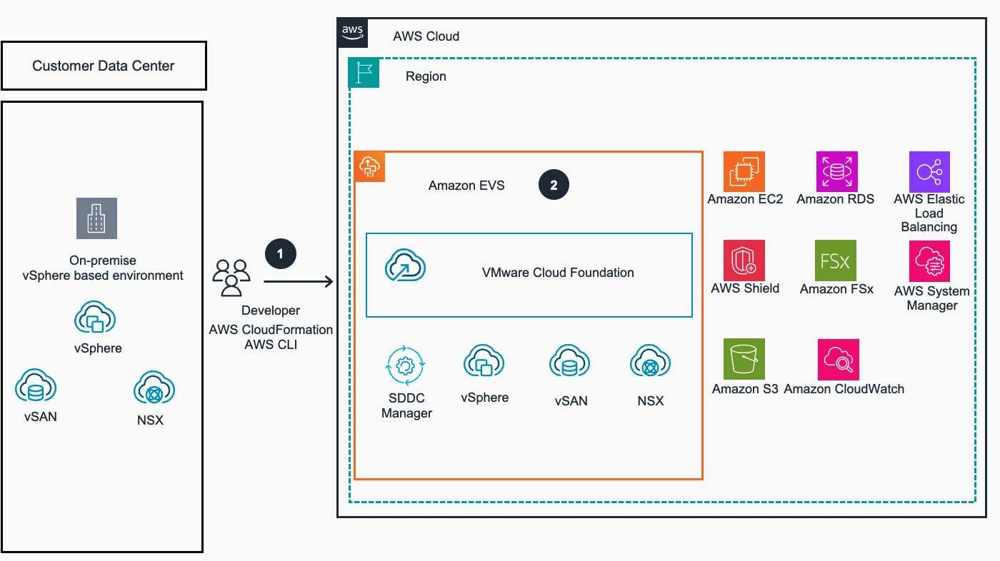
<i>Figure 1:  Automated Configuration of Elastic VMware Service (EVS) - Reference Architecture </i>

<br/>The provided [CloudFormation Template](https://github.com/aws-solutions-library-samples/guidance-for-automated-setup-for-elastic-vmware-service-on-aws/blob/main/deployment/evs_create_world.yaml) creates and configures the following services:

**Depoyment Architecture Steps**:

1. Developer/ DevOps users AWS CLI and [AWS CloudFormation(CFN)](https://aws.amazon.com/cloudformation/) for Infrastructure as code (IaC) deployment. This automation enables programmatic provisioning of [Amazon Elastic VMware Service (EVS)](https://aws.amazon.com/evs/) service and its dependencies through standardized AWS API and declarative CFN template.

2. The CFN provisions Amazon EVS as the primary service, integrated with essential AWS infrastructure services:
   - [Amazon Route 53](https://aws.amazon.com/route53/) DNS zones and records for forward and reverse lookups,
   - [Amazon VPC](https://aws.amazon.com/vpc/) networking infrastructure,
   - [Amazon VPC Route Server](https://aws.amazon.com/blogs/networking-and-content-delivery/dynamic-routing-using-amazon-vpc-route-server/) for dynamic routing within Amazon VPC using Border Gateway Protocol (BGP).,
   - 4-node VMware ESXi hypervisor cluster using bare metal [Amazon EC2](https://aws.amazon.com/ec2/) instances
   
3. Using Amazon EVS service, users can deploy and interact with familiar VMware tools and services: SDDC Manager for infrastructure management, vSphere for virtualization, vSAN for storage virtualization, NSX for networking virtualization, along with other native AWS services that can integrate with the VMware environment.
4. AWS services that can be integrated with Amazon EVS include: Amazon EC2, Amazon Elastic Load Balancing (ELB), Amazon FSx, AWS System Manager, Amazon S3, Amazon Dynamo DB, Amazon Cloud Watch, AWS System Manager and others.  

### External Connectivity Architecture
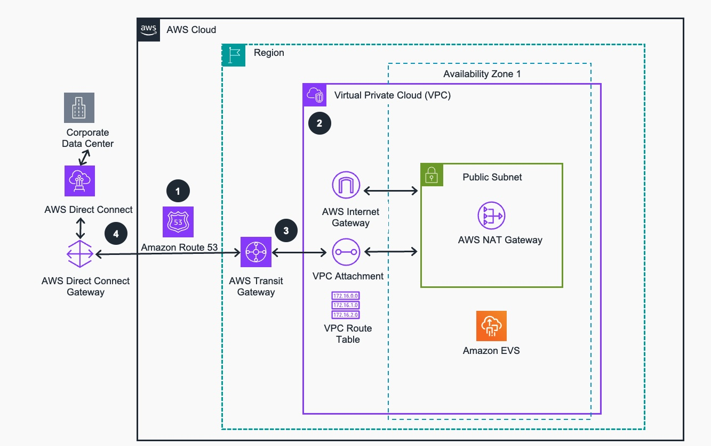
<i>Figure 2:  Setting up network access to Amazon EVS via AWS Direct Connect and AWS Transit Gateway service</i>

**Connectivity Architecture Steps**:
1. Create Amazon Route 53 forward and reverse hosted zones in the target AWS Region. Set up Amazon Route 53 inbound resolver endpoints so the Amazon Elastic Vmware (EVS) management components and ESXi hosts can resolve DNS names properly (implemented by CloudFormation template, see Slide 1). 
2. Amazon Virtual Private Cloud (VPC) is built with service access and public subnets in a single Availability Zone. Amazon Internet Gateway and NAT Gateway provide outbound internet access for private subnets. A custom DHCP Option Set is created to use the inbound resolvers from step 1 for DNS resolution and applied to the VPC. Deploy Amazon VPC Route Server with two endpoints in the service access subnet to handle BGP route exchange between Amazon EVS overlay networks and AWS underlay infrastructure.
3. Provision AWS Transit Gateway with Amazon VPC attachment and connect to the service access Subnet. 
4. For external connectivity, users may set up AWS Direct Connect Gateway to connect their corporate data center to the AWS Region and configure BGP routing to advertise routes between the on-premises network and AWS Transit Gateway for Amazon EVS workload migration.

### Internal EVS Service Connectivity Architecture
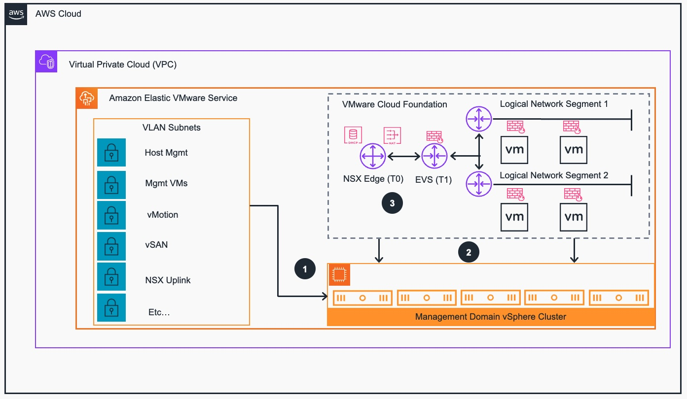
<i>Figure 3:  Internal connectivity and network topology of Amazon EVS components</i>

**Internal EVS Connectivity Architecture Steps**:

1. Amazon Elastic VMware Service (EVS) will provision Amazon (EC2) **i4i.metal** type instances for ESXi hosts using user provided Broadcom/VMware  keys and credentials. Amazon EVS will configure the initial VLAN subnets for host management, vMotion, vSAN, and NSX overlay networks.
2. The Amazon EVS deployment process includes initializing vSphere cluster and deploying the VMware Cloud Foundation software including the vCenter Server, SDDC Manager, and Cloud Builder appliances in the VM Management VLAN network segments.
3. The Amazon EVS deployment process will also deploy a three-node NSX Manager Cluster and a two-node NSX Edge Cluster.


## Architectural Components and their Relationships:

1. **VPC Infrastructure**
   - Underlay VPC with specified CIDR block
   - Two subnets:
       - Service Access Subnet (`MyCIDR.0.0/24`)
       - Public Access Subnet (`MyCIDR.5.0/24`)

2. **Networking Components**
   - Internet Gateway for public internet access
   - NAT Gateway for private subnet Internet access
   - Route Server (`ASN 65022`) with two Route Server endpoints and corresponding peers
   - Optional AWS Transit Gateway connection

3. **DNS Infrastructure**
   - Route 53 Resolver Endpoints
   - Forward and Reverse lookup zones
   - DHCP Options Set with custom DNS settings

4. **EVS Environment**
   - 4 ESXi hosts (`i4i.metal` instances)
   - VMware vCenter Server
   - NSX Manager Cluster (3 nodes)
   - NSX Edge Cluster (2 nodes)
   - SDDC Manager
   - Cloud Builder

5. **Network Segments (VLANs)**
   - VMkernel Management (`MyCIDR.10.0/24`)
   - vMotion (`MyCIDR.20.0/24`)
   - vSAN (`MyCIDR.30.0/24`)
   - VTEP (`MyCIDR.40.0/24`)
   - Edge VTEP (`MyCIDR.50.0/24`)
   - VM Management (`MyCIDR.60.0/24`)
   - HCX (`MyCIDR.70.0/24`)
   - NSX Uplink (`MyCIDR.80.0/24`)
   - 2x Expansion VLANs (`MyCIDR.90.0/24` & `MyCIDR.100.0/24`)
   
### AWS Services in this Guidance

| **AWS Service** | **Role** | **Description** |
|-----------------|----------|-----------------|
| [Amazon Elastic VMware Service](https://aws.amazon.com/evs/)/) (EVS) | Core service | Provides environment for running component of VMware environment on AWS |
| [Amazon Elastic Compute Cloud](https://aws.amazon.com/ec2/) (EC2) | Core service | Provides the compute instances for ESXi hosts. |
| [Amazon Virtual Private Cloud](https://aws.amazon.com/vpc/) (VPC) | Core Service | Creates an isolated network environment with public and private subnets across multiple Availability Zones. |
| [Amazon Elastic Block Store](https://aws.amazon.com/ebs) (EBS) | Core service | Provides persistent block storage volumes for EC2 instances |
| [Amazon Route 53](https://aws.amazon.com/route53/)| Core Service| Provides Forward and Reverse DNS lookup record for components of EVS service |
| [Amazon Transit Gateway](https://aws.amazon.com/transit-gateway/) (TGW) | Supporting service | Connect Amazon VPCs, AWS accounts, and on-premises networks to a single gateway |
| [AWS Identity and Access Management](https://aws.amazon.com/iam/) (IAM) | Supporting service | Manages access to AWS services and resources securely |
| [Amazon CloudWatch](https://aws.amazon.com/cloudwatch/) | Supporting service | Collects and tracks metrics, logs, and events from AWS resources provisoned in the guidance |
| [AWS CloudFormation](https://aws.amazon.com/cloudformation/) | Supporting service| Speed up cloud provisioning with infrastructure as code. 

### Cost

You are responsible for the cost of the AWS services used while running this Guidance. As of September 2025, the cost for running this Guidance with the default settings in the US East (N. Virginia) Region `us-east-1` is approximately _$7730 per month_ for a standard 4 ESXi node deployment.

We recommend creating a [Budget](https://docs.aws.amazon.com/cost-management/latest/userguide/budgets-managing-costs.html) through [AWS Cost Explorer](https://aws.amazon.com/aws-cost-management/aws-cost-explorer/) to help manage costs. Prices are subject to change. For full details, refer to the pricing webpage for each AWS service used in this Guidance.

### Sample Cost Table

| AWS Service                     | Dimensions                               | Cost [USD/month] |
|---------------------------------|------------------------------------------|------------|
| Amazon EC2 (ESXi hosts)         | 4 **i4i.metal** instances                | $7,603.20  |
| Amazon EVS Control Plane        | Per host per hour                        | $0.92      |
| NAT Gateway                     | 1 NAT Gateway with data transfer         | $32.85     |
| Route 53                        | Hosted zones and queries                 | $1.00      |
| VPC Route Server                | 1 Route Server with 2 endpoints per hour | $0.40      |
| Data Transfer                   | 1 TB outbound                            | $90.00     |
|**Total:**                       |                                          | **$7728.37**|

You can find additional pricing information on the [Amazon EVS Pricing Page](https://aws.amazon.com/evs/pricing/).

## Prerequisites

### Operating System

These deployment instructions are optimized for Amazon Linux 2. You'll need:
- [AWS CLI v2](https://docs.aws.amazon.com/cli/latest/userguide/getting-started-install.html)
- [Python 3.8](https://www.python.org/downloads/release/python-380/) or later
- [git CLI client](https://git-scm.com/downloads)

### AWS Account Requirements

1. AWS Business Support or higher subscription
2. Amazon EVS service level quotas are adequately set, [see additional info here](https://docs.aws.amazon.com/evs/latest/userguide/service-quotas-evs.html)
3. Valid VMware Cloud Foundation (VCF) and vSAN license keys with corresponding Site ID
4. ACM certificate (if using TLS)

## Important Notes and Limitations
1. DNS Configuration: This template only supports Route 53 as the DNS provider. For environments requiring custom DNS servers, please refer to the manual setup process in the Amazon EVS User Guide.
2. Single Availability Zone: This template deploys the EVS environment in a single Availability Zone.
3. Initial Configuration: The template provides a basic EVS environment. Additional configuration may be required based on your specific use case.

### Important Note About DNS Configuration
This CloudFormation template is designed to work exclusively with Amazon Route 53 for DNS management. If you need to use your own DNS server:
- Do not use this automation template
- Ensure your DNS server is resolvable within your VPC
- Follow the manual setup instructions in the [Amazon EVS User Guide](https://docs.aws.amazon.com/evs/latest/userguide/getting-started.html)

### Service Limits

The following service quotas must be available:
- EVS host count per environment: Minimum 4
- EC2 Running On-Demand **i4i.metal** instances: 512 vCPUs (4 instances × 128 vCPUs)

### Security

When you build systems on AWS infrastructure, security responsibilities are shared between you and AWS. This shared responsibility model in the context of Amazon Elastic VMware Service means that Amazon is responsible for the security of the physical infrastructure and the initial deployment of the VMware Cloud Foundations (VCF) software. Customers are responsible for the security of their VCF configurations and their respective virtual machines. Customers are also responsible for the life-cycling of the VCF stack. 

Organizations will need to ensure the security of their underlay VPC, subnets, Transit Gateway (if deployed), and all VMware NSX firewall rules meet their respective security standards. It is important to note that AWS Security Groups do not function on elastic network interfaces that are attached to Amazon EVS VLAN subnets. To control traffic to and from Amazon EVS VLAN subnets, you must use a network access control list. For more information, [review the EVS documentation here](https://docs.aws.amazon.com/evs/latest/userguide/getting-started.html#getting-started-create-nacl-vlan-traffic).

## Deployment Steps

### Deployment Using CLI

1. Clone this guidance code repository:
```bash
git clone https://github.com/aws-solutions-library-samples/guidance-for-automated-setup-for-elastic-vmware-service-on-aws.git
```

2. Navigate to the cloned source code directory containing CloudFormation template:
```bash
cd guidance-for-automated-setup-for-elastic-vmware-service-on-aws/deployment
```
3. Deploy the CloudFormation template 

```bash
aws cloudformation create-stack \
  --stack-name evs-environment \
  --template-body file://evs_create_world.yaml \
  --parameters \
    ParameterKey=MyFQDN,ParameterValue=my.fqdn.evs \
    ParameterKey=MyCIDR,ParameterValue=10.0. \
    ParameterKey=MySiteId,ParameterValue=your-site-id \
    ParameterKey=MySolutionKey,ParameterValue=your-solution-key \
    ParameterKey=MyVsanKey,ParameterValue=your-vsan-key
```

### Deployment Validation

1. Monitor the CloudFormation stack status in the AWS Console or using command:
```bash
aws cloudformation describe-stacks --stack-name evs-environment
```

### Deploy Using AWS CloudFormation Console

1. Clone this guidance code repository:
```bash
git clone https://github.com/aws-solutions-library-samples/guidance-for-automated-setup-for-elastic-vmware-service-on-aws.git
```
2. Sign in to the AWS Management Console and open the CloudFormation [console](https://console.aws.amazon.com/cloudformation/)
3. Choose "Create stack" and then select "With new resources (standard)".
4. In the "Specify template" section, select "Upload a template file".
5. Click "Choose file" and navigate to the cloned repository directory, `deployment` subdirectory.
6. Select the `evs_create_world.yaml` file and click "Open".
7. Click "Next".
8. On the "Specify stack details" page:
- Enter a Stack name (e.g., "EVS-Automated-Deployment")
- Fill in the required parameters:
  - `MyFQDN`: The fully qualified domain name for your EVS environment
  - `MyCIDR`: The base CIDR for the VPC (e.g., `10.0.`)
  - `MySiteId`: Your Broadcom VCF Site ID - **must be valid**
  - `MySolutionKey`: Your VCF solution license key - **must be valid**
  - `MyVsanKey`: Your vSAN license key- **must be valid**
  - (Fill in any other required parameters as specified in the template)
9. Click "Next".
10. On the "Configure Stack options" page, you can add tags, set permissions, and configure advanced options if needed. For most deployments, you can leave these settings at their defaults.
11. Click "Next".
12. On the "Review" page, review your settings. Be sure to check the acknowledgment at the bottom of the page if your template creates IAM resources.
13. Click "Create stack".

>NOTE: **CloudFormation stack will now begin creating the AWS resources for your EVS environment. This process may take several hours to complete**.

#### Monitor Console Deployment Progress

1. On the CloudFormation console, select your stack.
2. Go to the "Events" tab to monitor the creation progress.
3. Once the status changes to "CREATE_COMPLETE", your EVS environment is ready. In case of any failure, examine the root cause of failure, make correction and try again. 

### Review Console Outputs

After the CloudFormation stack creation is complete:

1. Go to the "Resources" tab of your stack.
2. Here you will find important information about your deployed resources, including:
- `EVSEnvironmentId`: The ID of your new EVS environment
- `VPCId`: The ID of the VPC created for your environment
- `ServiceAccessSubnetId`: The ID of the subnet used for service access
- `Route53ForwardZoneId` and `Route53ReverseZoneId`: IDs for the DNS zones
- Other relevant IDs and IP addresses
- Here is an example of the complete set of AWS resources that get deployed:
  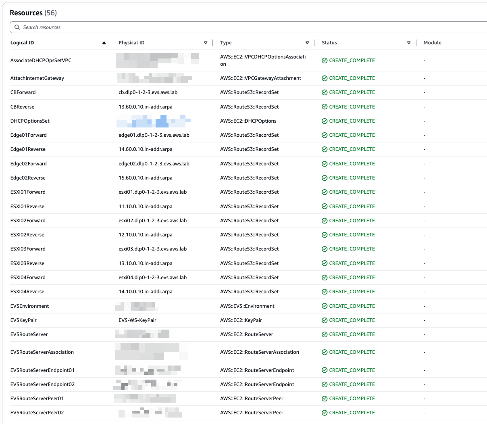
  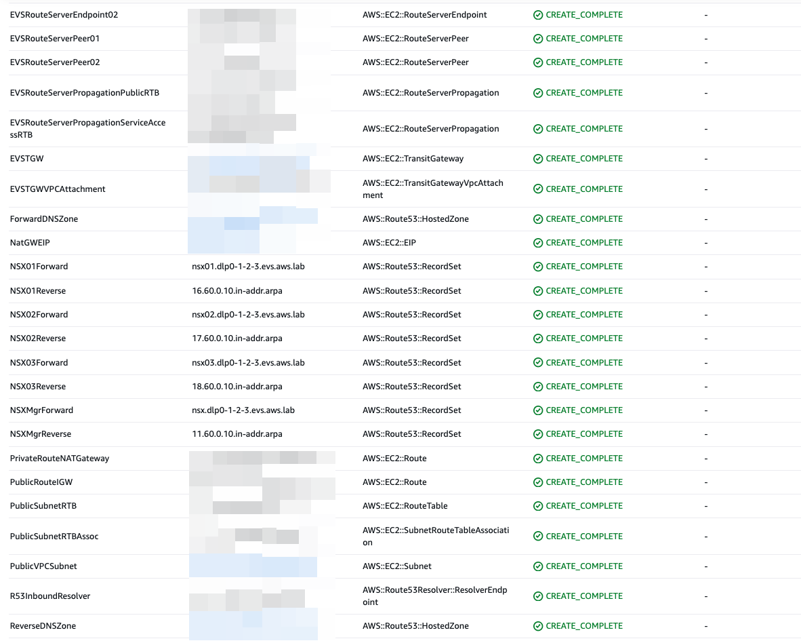
  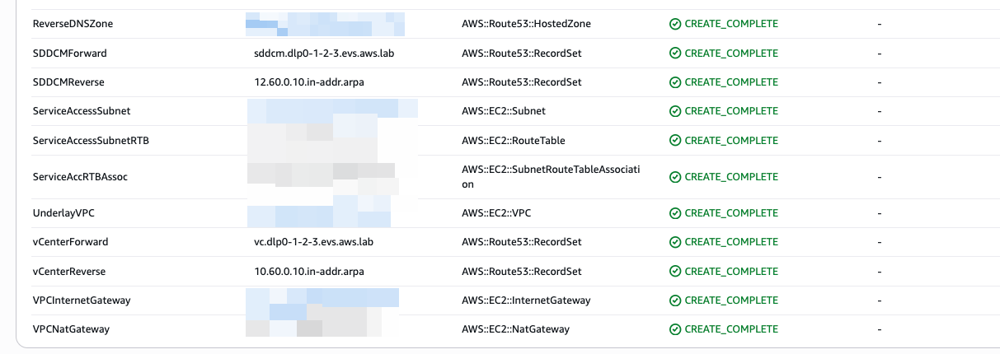
  <i>Figure 4:  Automated Setup for Elastic VMware Service (EVS) - Resources created by CloudFormation Stack </i>
  
3. You can review the input parameters at any time in the parameters tab:
  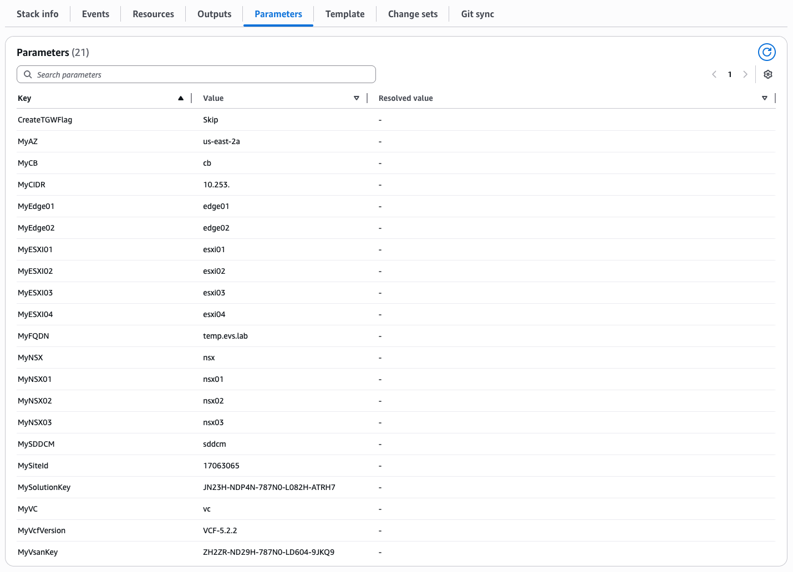
  <i>Figure 5:  Automated Setup for Elastic VMware Service (EVS) - Input Parameters used by CloudFormation Stack </i>

Make note of these outputs as they will be useful for further configuration and management of your EVS environment.

### Verify Environment
1. Once deployment is completed, verify EVS environment creation in the AWS EVS console or using command:
```bash
aws evs get-environment --environment-id [environment-id]
```
Here are example views of the host and network tab respectively:
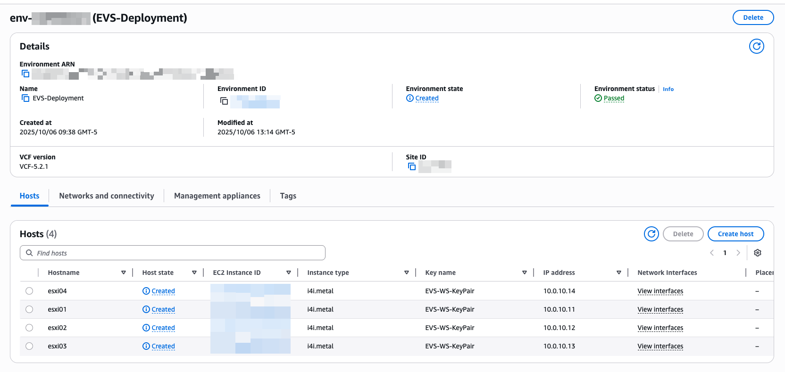
<i>Figure 6:  Automated Setup for Elastic VMware Service (EVS) - ESXi Hosts</i>


<i>Figure 7:  Automated Setup for Elastic VMware Service (EVS) - Networking</i>
 
2. Validate Route 53 configuration via the AWS console or using the following commands:
   a. Check that the hosted zones are created:
   ```bash
   aws route53 list-hosted-zones
   ```
   b. Verify DNS records for EVS components:
   ```bash
   aws route53 list-resource-record-sets --hosted-zone-id [your-hosted-zone-id]
   ```
   Here is an example of the forward and reverse record sets:
   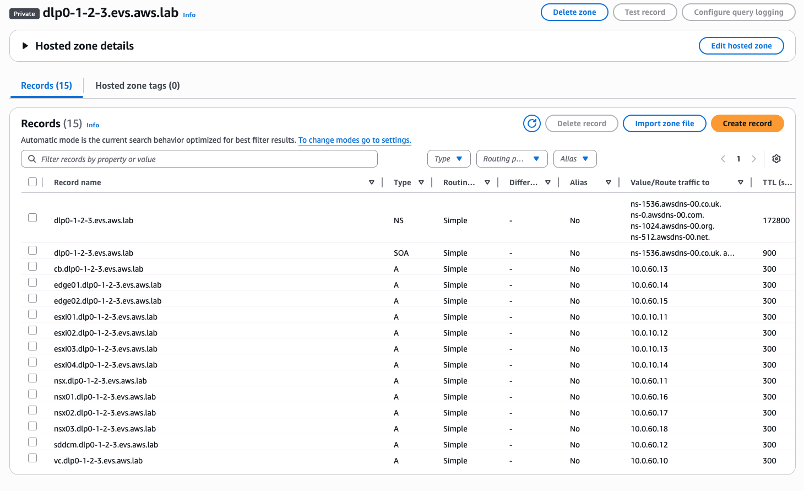
   <i>Figure 8:  Automated Setup for Elastic VMware Service (EVS) - Forward Lookup DNS records</i>
   
   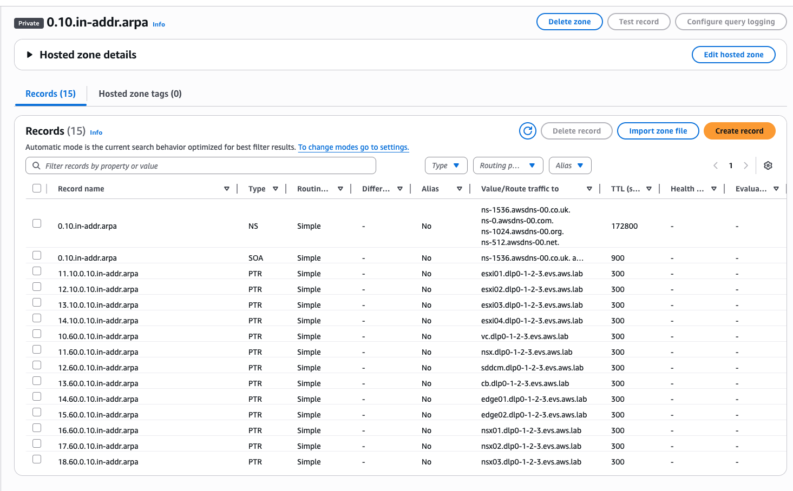
   <i>Figure 9:  Automated Setup for Elastic VMware Service (EVS) - Reverse Lookup DNS records</i>
   
   c. Test DNS resolution for a few key components:
   ```bash
   nslookup [component-name].[your-domain] [route53-resolver-ip]
   ```

## Running the Guidance

After successful guidance deployment, follow these steps to access your EVS environment:

1. Retrieve VCF credentials from AWS Secrets Manager following the [EVS User Guide](https://docs.aws.amazon.com/evs/latest/userguide/getting-started-retrieve-credentials.html)

2. Access your EVS environment components:
   - vCenter Server
   - NSX Manager
   - SDDC Manager

For detailed instructions on using EVS service, refer to the [Amazon EVS User Guide](https://docs.aws.amazon.com/evs/latest/userguide/).

## Next Steps

1. [Configure additional security settings](https://docs.aws.amazon.com/evs/latest/userguide/security.html)
2. [Set up VMware HCX for migrations](https://docs.aws.amazon.com/evs/latest/userguide/migrate-evs-hcx.html)
3. [Add additional hosts as needed](https://docs.aws.amazon.com/evs/latest/userguide/evs-env-create-host.html)
4. [Configure backup and disaster recovery](https://docs.aws.amazon.com/evs/latest/userguide/disaster-recovery-resiliency.html)
5. [Review the basics of managing an EVS Environment](https://docs.aws.amazon.com/evs/latest/userguide/env-mgmt.html)

## Troubleshooting

1. Prior to the launch of this CloudFormation [template](https://github.com/aws-solutions-library-samples/guidance-for-automated-setup-for-elastic-vmware-service-on-aws/blob/main/deployment/evs_create_world.yaml), verify that you have correctly entered your VCF-related Broadcom license information
2. In the event of a deployment failure we recommend the following:
   1. If the failure occurred during the deployment of the EVS Environment, please open a support case
   2. If the failure occurred prior to the deployment of the EVS Environment, take note of the errors, delete the Stack and try again 
   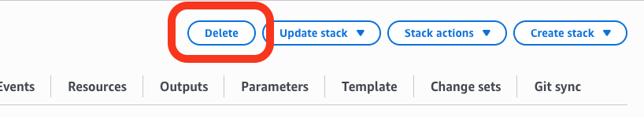
  <i>Figure 10:  Automated Setup for Elastic VMware Service (EVS) - Deleting CloudFormation Stack </i>
  
For additional information on troubleshooting your Amazon EVS Environment, [please refer to the documentation](https://docs.aws.amazon.com/evs/latest/userguide/troubleshooting.html).

## Cleanup
Please note that the EVS environment must be manually removed before the CloudFormation stack is deleted.

1. Delete EVS ESXi hosts:
```bash
aws evs delete-environment-host --environment-id [environment-id] --host [host] 
```

2. Delete the EVS environment:
```bash
aws evs delete-environment --environment-id [environment-id]
```

3. Delete the CloudFormation stack:
```bash
aws cloudformation delete-stack --stack-name evs-environment
```
4. Verify that all EVS and related resources are properly cleaned up in the AWS Console

## Notices

Customers are responsible for making their own independent assessment of the information in this Guidance. This Guidance: (a) is for informational purposes only, (b) represents AWS current product offerings and practices, which are subject to change without notice, and (c) does not create any commitments or assurances from AWS and its affiliates, suppliers or licensors. AWS products or services are provided "as is" without warranties, representations, or conditions of any kind, whether express or implied. AWS responsibilities and liabilities to its customers are controlled by AWS agreements, and this Guidance is not part of, nor does it modify, any agreement between AWS and its customers.

## Authors

- David Piet, Principal Specialist SA, Migration & Modernization
- Daniel Zilberman, Sr. Specialist SA, Technical Solutions
- Deepika Suresh, Specialist SA, Technical Solutions
- Johanna Wood, Technical Lead, Technical Solutions
